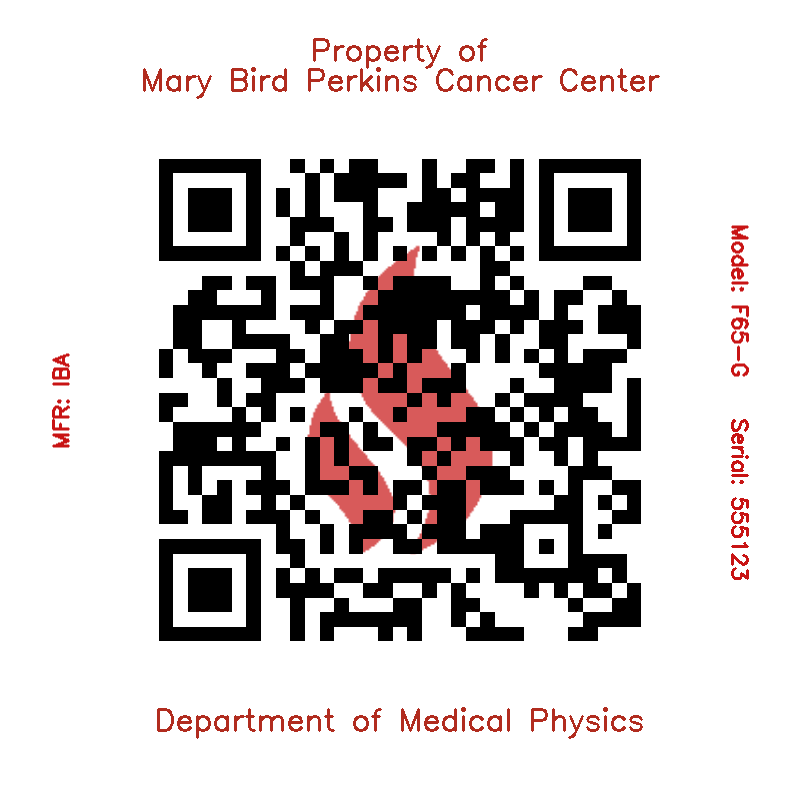

# Mary Bird Perkins Cancer Center QR Code Generator

This project generates custom QR codes that integrate with the Mary Bird Perkins Cancer Center flame logo, creating professional, branded QR codes for equipment labeling and identification.



## Features

- Combines QR codes with the Mary Bird Perkins flame logo
- Adds equipment information (manufacturer, model number, serial number)
- Maintains full QR code scannability while preserving brand identity
- Optimized for use with label makers
- Supports both individual and batch generation

## Setup

1. Create a conda environment with the required dependencies:
   ```
   conda create -n QRC python=3.8
   conda activate QRC
   conda install numpy pillow qrcode opencv
   ```

2. Clone this repository:
   ```
   git clone https://github.com/yourusername/mbp-qrcodes.git
   cd mbp-qrcodes
   ```

## Usage

### Single QR Code

1. Run the generator script:
   ```
   ./generate_qr.sh
   ```

2. When prompted:
   - Enter the URL to encode in the QR code
   - Enter manufacturer information (optional)
   - Enter model number (optional)
   - Enter serial number (optional)

3. The generated QR code will be saved in the `Generated_QR` directory.

### Batch Generation

For generating multiple QR codes at once:

1. Create a text file with URLs (one per line) or use command line arguments:

2. Run the batch generator script:
   ```
   ./batch_generate.sh -f file_with_urls.txt -m "IBA" -d "F65-G" -s "555123"
   ```
   
   Or specify URLs directly:
   ```
   ./batch_generate.sh -u "https://www.marybird.org/device1" "https://www.marybird.org/device2" -m "IBA" -d "F65-G" -s "555123"
   ```

#### Batch Generator Options

```
usage: batch_generate.py [-h] [-f FILE] [-u URLS [URLS ...]] [-o OUTPUT] [-m MANUFACTURER] [-d MODEL] [-s SERIAL]

Generate QR codes within the Mary Bird Perkins logo flame

options:
  -h, --help            show this help message and exit
  -f FILE, --file FILE  File containing URLs (one per line)
  -u URLS [URLS ...], --urls URLS [URLS ...]
                        List of URLs to encode
  -o OUTPUT, --output OUTPUT
                        Output directory
  -m MANUFACTURER, --manufacturer MANUFACTURER
                        Equipment manufacturer name
  -d MODEL, --model MODEL
                        Equipment model number
  -s SERIAL, --serial SERIAL
                        Equipment serial number
```

## Design Details

The QR codes follow the official Mary Bird Perkins design requirements:

1. Header text: "Property of Mary Bird Perkins Cancer Center" 
2. Footer text: "Department of Medical Physics"
3. Left side (rotated): "MFR: [manufacturer]"
4. Right side (rotated): 
   - "Model: [model]" 
   - "Serial: [serial]"
5. All text matches the Mary Bird Perkins flame red color

## Technical Implementation

The generator performs the following operations:

1. Extracts the flame shape from the logo using color filtering
2. Generates a QR code with high error correction for the provided URL
3. Overlays the QR code on top of the semi-transparent flame
4. Adds properly rotated text elements for manufacturer, model, and serial information
5. Creates a compact layout optimized for label printing

### Optimization for Scanning Reliability

The QR codes are designed for maximum scannability:

- High error correction (Level H - up to 30% QR code obstruction)
- QR code on top of the flame for better contrast
- Standard black QR modules on white background
- Proper quiet zones (white margins) around the code
- Clean edges on QR code elements

## Files

- `qr_generator.py` - Main Python script that generates the QR codes
- `generate_qr.sh` - Shell script for single QR code generation
- `batch_generate.py` - Python script for batch generating QR codes
- `batch_generate.sh` - Shell script for batch generation
- `sample_urls.txt` - Example URLs for batch generation
- `Resources/` - Directory containing the logo images
- `Generated_QR/` - Output directory (created automatically)